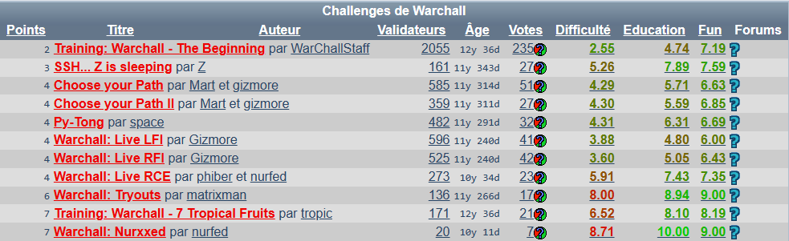
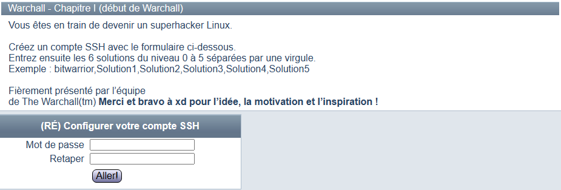
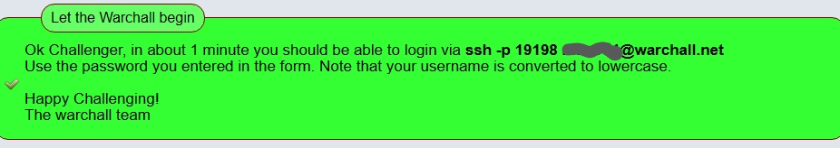

# Warchall
Cette "repository" contient les étapes pour avoir les clés de chaque level sur le challenge **[Wechall] Warchall challenge**.

Pour accédé à **Warchall**, tout d’abord créez un compte sur le site web **Wechall** puis, aller au [Warchall challenge](https://www.wechall.net/challs/warchall).

Sélectionner le level que vous choisissez de faire.

Ensuite, vous accédez à une  page web où vous insérez le mot de passe pour vous connecter au serveur.

Puis, vous recevrais le commande **ssh** à copier sur une ligne de commande Linux. 

**Exemple  de lien de connexion**
